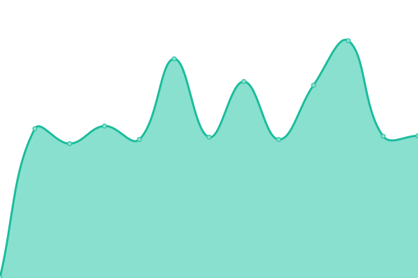

# [📈 Live Status](https://uptime.simplelogin.io): <!--live status--> **🟧 Partial outage**

This repository contains the open-source uptime monitor and status page for [SimpleLogin](https://simplelogin.io), powered by [Upptime](https://github.com/upptime/upptime).

With [Upptime](https://upptime.js.org), you can get your own unlimited and free uptime monitor and status page, powered entirely by a GitHub repository. We use [Issues](https://github.com/simple-login/uptime/issues) as incident reports, [Actions](https://github.com/simple-login/uptime/actions) as uptime monitors, and [Pages](https://uptime.simplelogin.io) for the status page.

<!--start: status pages-->
<!-- This summary is generated by Upptime (https://github.com/upptime/upptime) -->
<!-- Do not edit this manually, your changes will be overwritten -->
<!-- prettier-ignore -->
| URL | Status | History | Response Time | Uptime |
| --- | ------ | ------- | ------------- | ------ |
|  [SimpleLogin Landing Page](https://simplelogin.io) | 🟥 Down | [simple-login-landing-page.yml](https://github.com/simple-login/uptime/commits/HEAD/history/simple-login-landing-page.yml) | 

 504ms
     
 | 

<a href="https://simple-login.github.io/uptime/history/simple-login-landing-page">100.00%</a>
    

|  [SimpleLogin API](https://app.simplelogin.io/live) | 🟥 Down | [simple-login-api.yml](https://github.com/simple-login/uptime/commits/HEAD/history/simple-login-api.yml) | 

 320ms
     
 | 

<a href="https://simple-login.github.io/uptime/history/simple-login-api">100.00%</a>
    

|  [SimpleLogin MX1](https://mx1.simplelogin.co/live) | 🟥 Down | [simple-login-mx-1.yml](https://github.com/simple-login/uptime/commits/HEAD/history/simple-login-mx-1.yml) | 

 321ms
     
 | 

<a href="https://simple-login.github.io/uptime/history/simple-login-mx-1">100.00%</a>
    

|  [SimpleLogin MX2](https://mx2.simplelogin.co/live) | 🟩 Up | [simple-login-mx-2.yml](https://github.com/simple-login/uptime/commits/HEAD/history/simple-login-mx-2.yml) | 

 607ms
     
 | 

<a href="https://simple-login.github.io/uptime/history/simple-login-mx-2">99.87%</a>
    

<!--end: status pages-->

[**Visit our status website →**](https://uptime.simplelogin.io)

## 📄 License

- Powered by: [Upptime](https://github.com/upptime/upptime)
- Code: [MIT](./LICENSE) © [SimpleLogin](https://simplelogin.io)
- Data in the `./history` directory: [Open Database License](https://opendatacommons.org/licenses/odbl/1-0/)
